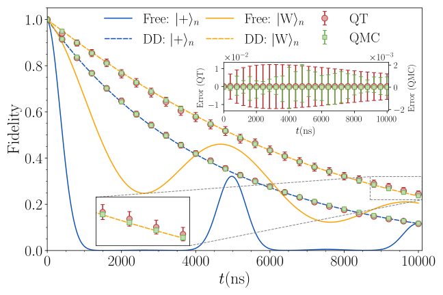
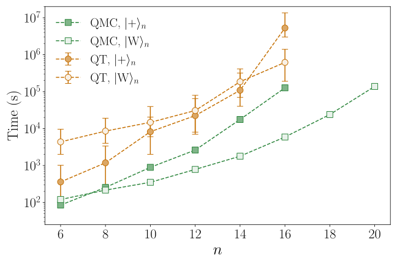
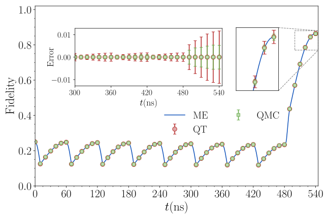
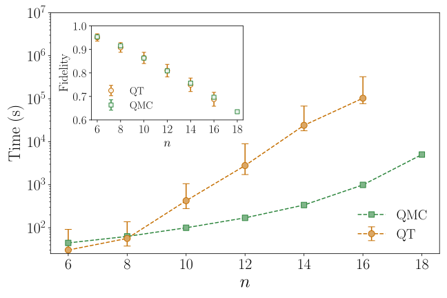
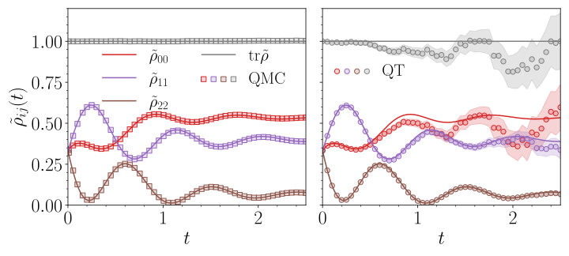

# Data Repository for "Real-time Quantum Monte Carlo Algorithm For Noisy Quantum Circuit SimulationsQuantum Circuit Simulations"

Tong Shen and Daniel A. Lidar

### Abstract
We present a real-time quantum Monte Carlo algorithm that simulates the dynamics of open quantum systems by stochastically compressing and evolving the density matrix under both Markovian and non-Markovian master equations. Our algorithm uses population dynamics to continuously suppress the sign problem, preventing its accumulation throughout the evolution. We apply it to a variety of quantum circuits and demonstrate significant speedups over state-of-art quantum trajectory methods and convergence to exact solutions even in non-Markovian regimes where trajectory methods fail. Our approach improves the efficiency of classical simulation of gate-based quantum computing, quantum annealing, and general open system dynamics.

### Description
This repository includes links, code, scripts, and data to generate the figures in a paper.

### Requirements
The data in this project was generated via [OpenQMC.jl](https://github.com/USCqserver/OpenQMC.jl). Everything included in the data directory was processed from the raw data on Zenodo.

### Figures
#### Figure 01: Benchmark for 10-qubit crosstalk suppression circuit

#### Figure 02: Scaling of QMC and QT for crosstalk suppression circuits

#### Figure 03: Benchmark for 10-qubit GHZ state preparation circuit

#### Figure 04: Scaling of QMC and QT for GHZ state preparation circuit

#### Figure 05: Simulation for a 2-qubit Redfield master equation

### Support
This material is based upon work supported by, or in part by, the U. S. Army Research Laboratory and the U.S. Army Research Office under contract/grant number W911NF2310255.
